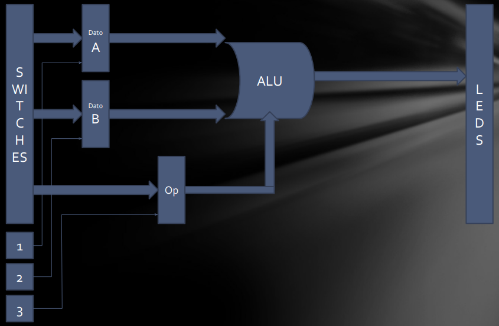
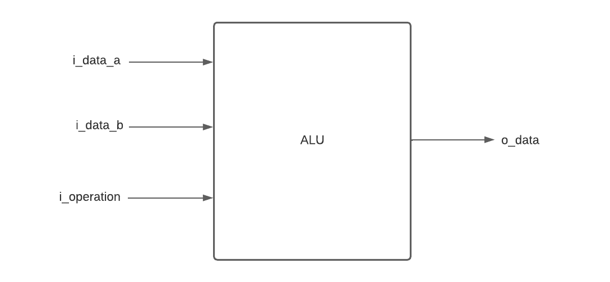
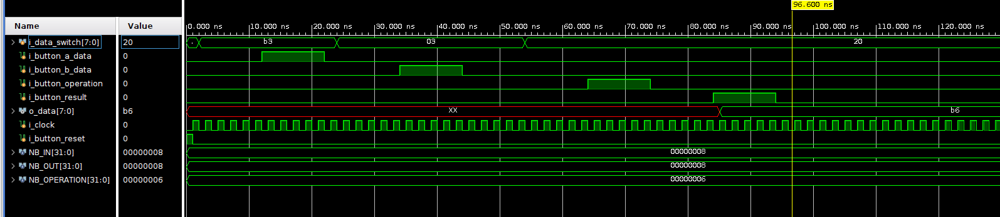
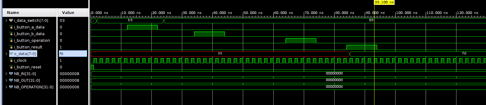
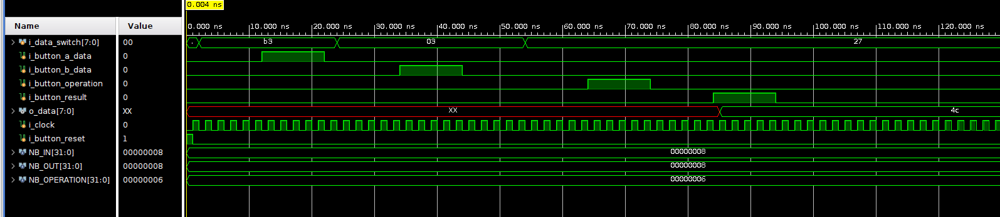

# Trabajo práctico N°1: ALU

## Alumnos: Fabio Gazzoni - Evangelina Castellano 

Se implemento en una FPGA Basys 3 una ALU parametrizable que consiste en:
- N switches que se utilizarán para indicar el valor de los dos operadores y el código de operación.
- Un botón para que al ser presionado se cargue el valor representado en los switches en el dato A.
- Un botón para que al ser presionado se cargue el valor representado en los switches en el dato B.
- Un botón para que al ser presionado se cargue el valor representado en los switches en el código de operación.
- N LEDs que mostrarán el resultado de la operación realizada.

En la imágen se puede observar su esquemático:

Las operaciones que realizará y sus respectivos códigos de operación se pueden observar en la siguiente tabla:

| Operación | Código |
|-----------|:------:|
| ADD       | 100000 |
| SUB       | 100010 |
| AND       | 100100 |
| OR        | 100101 |
| XOR       | 100110 |
| SRA       | 000011 |
| SRL       | 000010 |
| NOR       | 100111 | 

El proyecto consiste en un módulo _ALU_ que realizará la operación que se le indique y de un módulo _top_ 
### Modulo ALU
El proyecto consiste en un módulo ALU que se encargará de realizar la operación que se le indique. 

### Modulo top

TODO: Explicar

### Testbench
El operando A es _b10110011_ y el operando B es _b00000011_

#### Operación: suma

#### Operación: resta

#### Operación: AND

#### Operación: OR

#### Operación: XOR

##### Operación: SRA

##### Operación: SRL

##### Operación: XNOR

##### Operación invalida:

